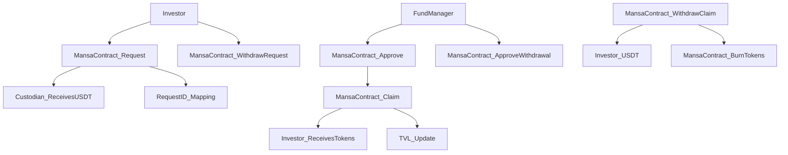
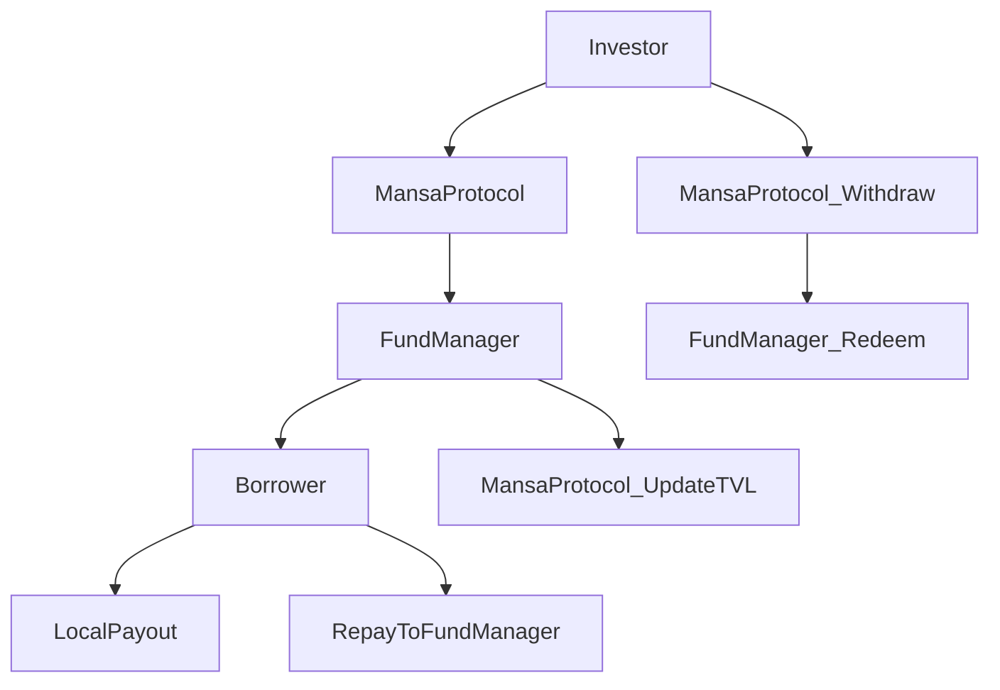
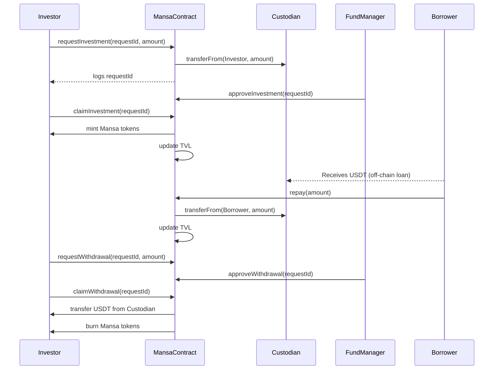

# Mansa Protocol

Mansa is a programmable liquidity infrastructure purpose-built to solve cross-border payout liquidity gaps using DeFi rails. This repository contains the core contract `Mansa.sol`, a tokenized vault enabling asynchronous deposits, interest accrual, and off-chain loan disbursements.

---

## 🧠 Overview 


Mansa lets **investors (lenders)** deposit USDT into a vault, earn yield, and redeem with flexibility. Funds are managed by an **admin/custodian** and loaned to **off-chain borrowers** (e.g., PSPs and fintechs) for local payouts. The contract follows the ERC-7540 standard, supporting asynchronous vault flows

---

## 🔧 Protocol Standards & Architecture
Mansa implements key Ethereum standards to ensure modularity, upgradeability, and interoperability:

UUPS (EIP-1822): Our smart contracts are built using the UUPS (Universal Upgradeable Proxy Standard) pattern, enabling lightweight and secure upgradeability with minimal storage overhead.

ERC-4626 (Read-Only Support): Mansa Vaults are partially compliant with the ERC-4626 Tokenized Vault standard. We expose all read-only interfaces to support ecosystem integrations and composability with DeFi protocols, without enforcing deposit/withdraw semantics that don't match our permissioned architecture.

ERC-7540 (Request-Based Flows): We follow the ERC-7540 specification to enable structured request/response workflows. This allows third-party frontends and services to initiate deposit and redemption requests through standardized interfaces, making Mansa compatible with intent-based execution models and programmable liquidity routing.

---

## 🔁 Actors

### Investor (Lender)
- Provides USDT liquidity via `requestInvestment()`
- Receives LP tokens (`Mansa`) after approval + claim
- Earns yield based on `dailyYieldMicrobip` and updated TVL
- May include a locked period via `commitedUntil`

### Borrower (Off-chain)
- A fintech, PSP, or payout platform needing short-term stablecoin liquidity
- Submits loan request via off-chain platform (linked to `requestId`)
- Repays on-chain via `repay()`

### Fund Manager / Admin
- Approves investment & withdrawal requests
- Sets yield rate
- Updates TVL via `updateTvl()`
- Handles emergency pause, custodianship, and configuration

### Custodian
- Holds USDT capital
- Receives deposits, disburses to borrowers, handles repayments

---

## 💸 Yield Mechanics

- Yield is set in **microbips** (1/10000 of a basis point): `dailyYieldMicrobip`
- Compounds daily based on block timestamp
- TVL increases over time via compound interest

---

## 🔓 Lifecycle

---


---

## 📚 Key Concepts

| Concept       | Description                                                                 |
|---------------|-----------------------------------------------------------------------------|
| `requestId`   | Unique identifier for investment/withdrawal requests (used for off-chain sync)
| `commitedUntil` | Timestamp until which funds are locked and can’t be withdrawn              |
| `dailyYieldMicrobip` | Yield rate, compounded daily into TVL                              |
| `updatedTvlAt` | Timestamp of last TVL update                                               |
| `approveX` + `claimX` | Asynchronous vault pattern (ERC-7540 compliant)                |

---

## 🔐 Security Features
- Role-based access control via `AccessControl`
- Emergency pause via `Pausable`
- Whitelisting enforced via `Allowlist.sol`
- SafeERC20 operations for all transfers

---

## 📦 Files

```
contracts/
├── Mansa.sol          # Main vault contract (this repo)
├── Allowlist.sol      # Whitelist control

scripts/
├── deploy.s.sol       # Deployment script

foundry.toml           # Foundry configuration
README.md              # This file
```

---

## 📜 License
MIT License – see LICENSE file.

---

For documentation, integrations, or audits, please contact the Mansa team directly.


## Foundry

**Foundry is a blazing fast, portable and modular toolkit for Ethereum application development written in Rust.**

Foundry consists of:

-   **Forge**: Ethereum testing framework (like Truffle, Hardhat and DappTools).
-   **Cast**: Swiss army knife for interacting with EVM smart contracts, sending transactions and getting chain data.
-   **Anvil**: Local Ethereum node, akin to Ganache, Hardhat Network.
-   **Chisel**: Fast, utilitarian, and verbose solidity REPL.

## Documentation

https://book.getfoundry.sh/

## Usage

### Build

```shell
$ forge build
```

### Test

```shell
$ forge test
```

### Format

```shell
$ forge fmt
```

### Gas Snapshots

```shell
$ forge snapshot
```

### Anvil

```shell
$ anvil
```

### Deploy

```shell
$ forge script script/DeployMansa.s.sol --fork-url <chain_deploy_rpc>  --private-key <private_key> --broadcast --legacy --verify --verifier etherscan --verifier-url <verifier_url> --gas-limit 10000000

```

### Cast

```shell
$ cast <subcommand>
```

### Help

```shell
$ forge --help
$ anvil --help
$ cast --help
```